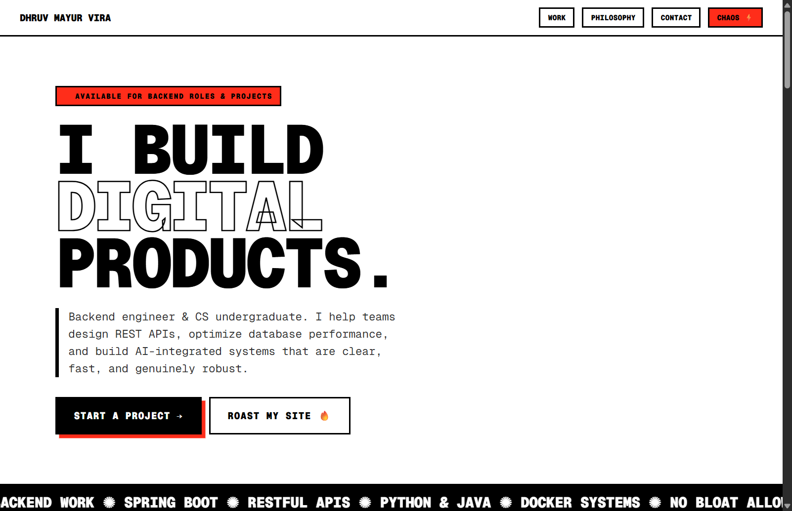
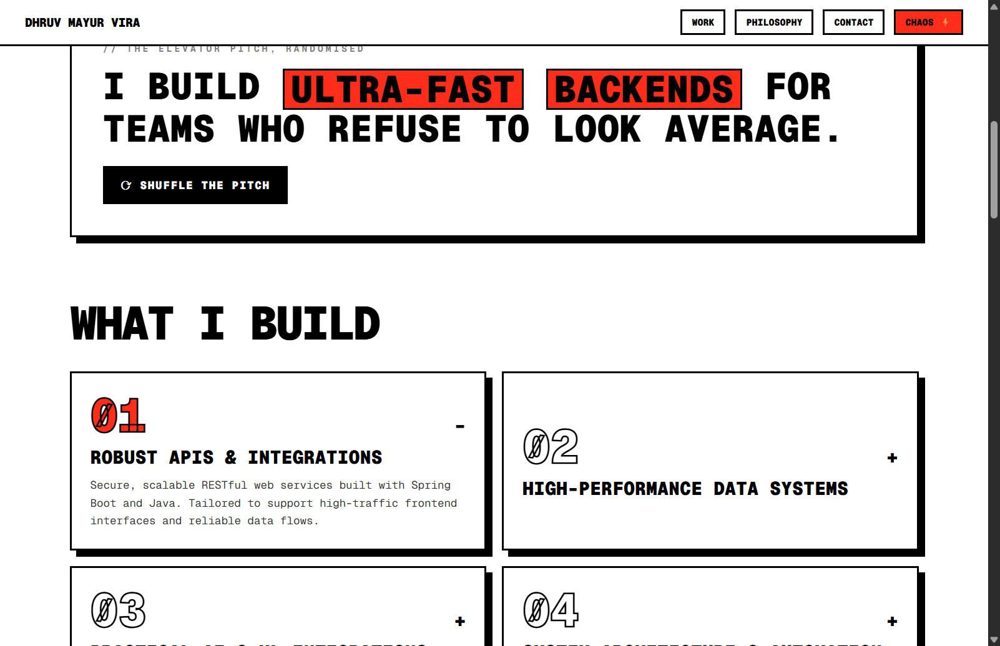
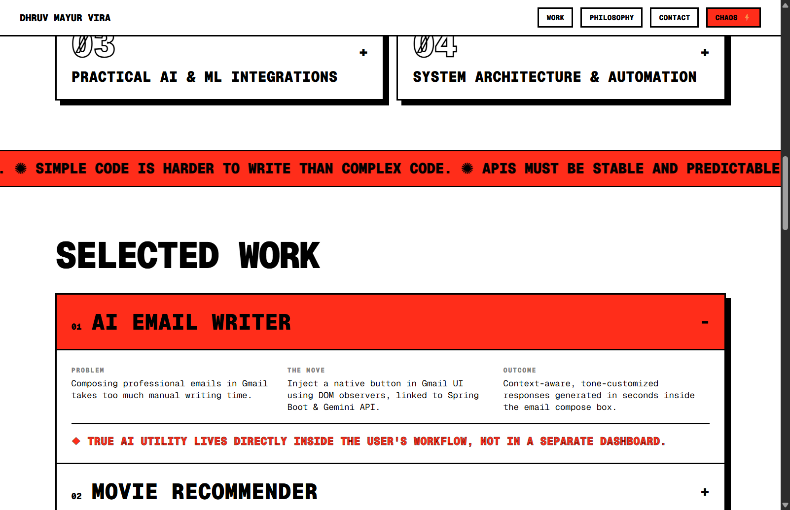
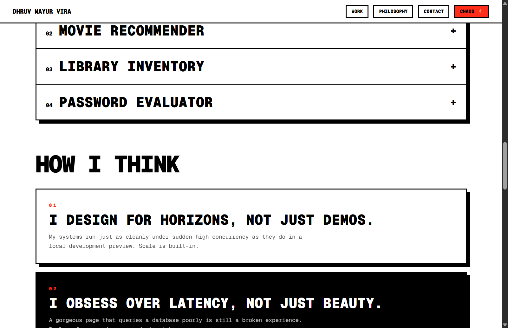
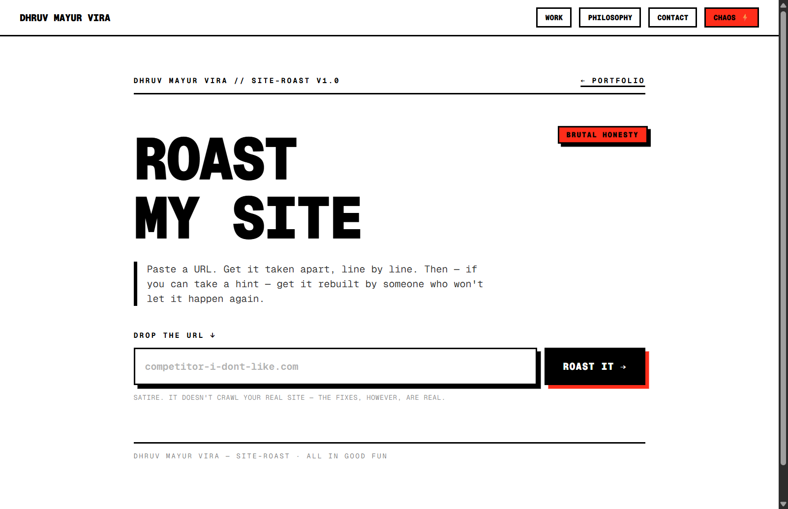
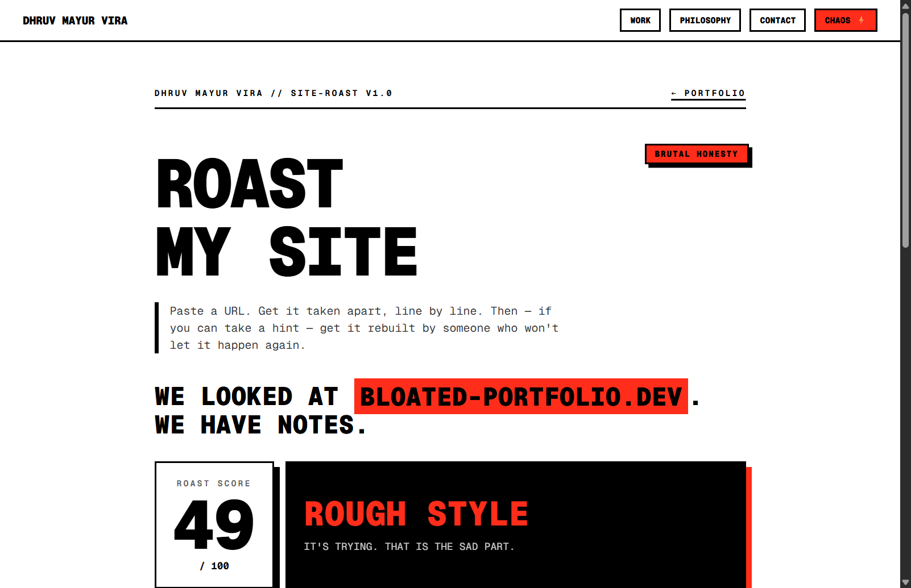

#  Dhruv Mayur Vira — Neo-Brutalist Developer Portfolio

A high-impact, premium developer portfolio and interactive site-roasting engine built with **React**, **Vite**, and **Tailwind CSS**. It follows a **Neo-Brutalist / Flat design aesthetic** featuring sharp layouts, heavy borders, custom typography, interactive sticker board, and a dynamic "Chaos" accent color cycling mechanism.

---

##  Theme & Aesthetic

The portfolio is designed with a **monospaced Brutalist theme**:
- **Chaos Mode ()**: Clicking the chaos badge in the header instantly cycles the site's accent color through a vibrant palette (Red, Blue, Yellow, Pink, and Green), applying it dynamically using CSS custom properties.
- **Micro-interactions**: Hover effects with rigid flat offsets, scrambled-text animations, blinking badges, and draggable sticker cards.

---

##  Portfolio Sections & Screenshots

### 1. Hero & Navigation Header
The entry point features a blinking availability badge, the signature Brutalist typography title "I BUILD DIGITAL PRODUCTS.", a monospaced intro statement, and quick navigation.



---

### 2. What I Build
A modular accordion grid outlining core services. Each skill card can be toggled to expand details on APIs, database optimization, AI/ML integrations, and containerization.



---

### 3. Selected Work
The portfolio archive showcases featured projects in an expandable, dark-themed accordion. Expanding a project reveals a clear layout showing the **Problem**, **The Move**, **Outcome**, and the architectural **Takeaway**.



---

### 4. Philosophy (How I Think) & Interactive Sticker Board
- **How I Think**: Highlights fundamental development rules, shifting contrast themes dynamically for readability.
- **Sticker Board**: A fun, interactive canvas where visitors can drag and drop custom backend stickers around the screen.



---

### 5. Side Quest: Roast My Site 
An interactive mock console utility where users can paste any URL and get a satirical, brutal critique of their site's load speed, design, trust popups, and typography.
- **Idle Form State**:
  

- **Completed Roast Result**:
  

---

##  Tech Stack & Technologies

- **Frontend Core**: React 19, Vite (Fast HMR)
- **Styling**: Tailwind CSS (customized for flat borders and rigid shadows)
- **Icons**: Lucide React
- **Typography**: Geist Mono
- **Interactions**: HTML5 Drag and Drop (Stickers), Custom React hooks for text scrambling & color-cycling

---

##  Running the App Locally

### Prerequisites
Make sure you have Node.js installed on your machine.

### Installation
Clone the repository and install all dependencies:
```bash
npm install
```

### Run the Development Server
Start the Vite local development server:
```bash
npm run dev
```
By default, the server runs at: [http://localhost:5173/](http://localhost:5173/)

### Build for Production
To build the static files into the `dist/` directory:
```bash
npm run build
```

### Preview the Build
To run a local server to preview the production build:
```bash
npm run preview
```

---

##  Contact Details

- **Owner**: Dhruv Mayur Vira
- **Email**: [dhruvvira17@gmail.com](mailto:dhruvvira17@gmail.com)
- **LinkedIn**: [LinkedIn Profile](https://www.linkedin.com/in/dhruv-vira-17/)
- **GitHub**: [github.com/dhruvv16-hash](https://github.com/dhruvv16-hash)
